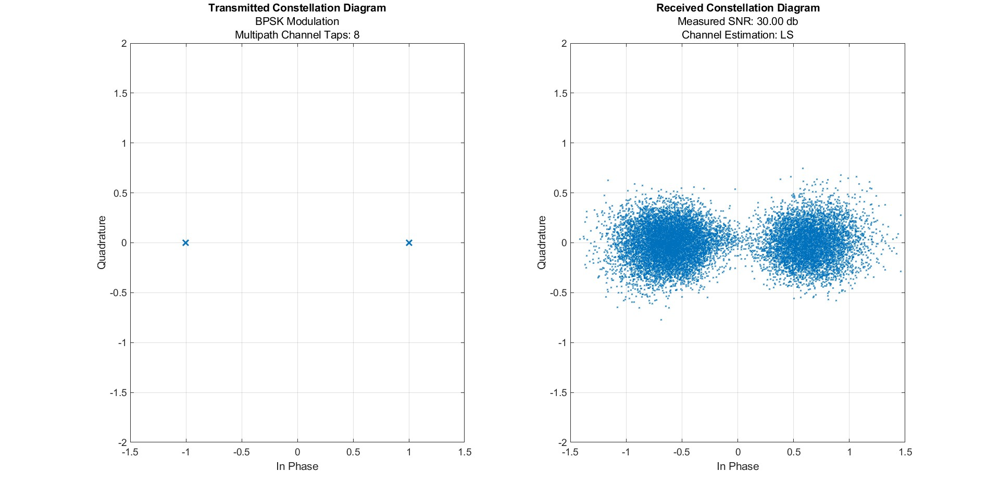
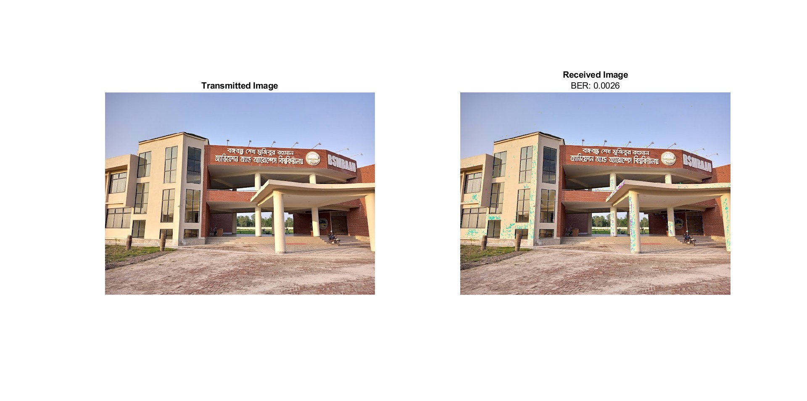

# **OFDM-Based Image Transmission System**

This repository contains the source code and documentation for a MATLAB-based simulation of an Orthogonal Frequency Division Multiplexing (OFDM) system designed for image transmission. The project demonstrates the use of core concepts like FFT, IFFT, convolution, and BPSK modulation to reliably transmit and reconstruct an image under noise and multipath fading conditions.

---

## **Project Overview**

This project was part of AVE 4501 (Signal and Systems) course. In this project we tried to learn and simulate about basics of OFDM and data modulation.Orthogonal Frequency Division Multiplexing (OFDM) is a widely used modulation technique in modern wireless communication systems, known for its robustness against intersymbol interference (ISI) and efficient bandwidth usage. This project simulates an OFDM-based transceiver that:
- Converts an image into a binary stream.
- Transmits the binary stream over an AWGN and multipath fading channel.
- Recovers the transmitted image at the receiver using FFT and channel estimation.

---

## **Key Features**
- **Modulation:** Binary Phase Shift Keying (BPSK).
- **Channel Effects:** Additive White Gaussian Noise (AWGN) and multipath fading.
- **Channel Estimation:** Least Squares (LS) method.
- **Performance Metrics:** Bit Error Rate (BER) and Signal-to-Noise Ratio (SNR).
- **Visualization:** Displays constellation diagrams and the transmitted and received images.

---

## **System Requirements**
- MATLAB R2020a or newer.
- Image Processing Toolbox (optional, for handling images).

---

## **Setup Instructions**

### **1. Clone the Repository**
```
git clone https://github.com/jamee47/OFDM_Image_transceiver.git
cd OFDM_Image_transceiver
```

## **Setup Instructions**

### **2. Prepare Input Data**
Place the input image in the `data` folder. Ensure the image file path is correctly referenced in the source code.

### **3. Run the Simulation**
Open the `OFDM_Image_Transceiver.m` file in MATLAB and execute it. The script will:
1. Preprocess the input image.
2. Simulate the OFDM transmission system.
3. Display performance metrics and visual results.

---

## **Simulation Parameters**
The following parameters are used in the simulation and can be adjusted in the source code:
- **FFT/IFFT Size (`n_fft`)**: 64.
- **Cyclic Prefix Length (`n_cpe`)**: 16.
- **SNR Levels (`snr`)**: 10, 20, 30 dB.
- **Channel Taps (`n_taps`)**: 8.
- **Modulation Scheme (`mod_method`)**: BPSK.

---

## **Results**
The simulation evaluates system performance under varying SNR conditions. Key results include:
- Constellation diagrams for transmitted and received signals.
- BER analysis for BPSK modulation.
- Reconstructed image demonstrating the system's robustness.

### **Example Outputs**
- **Constellation Diagram:**  
    

  **Transmitted and Received Image:**  
    


---

## **References**
1. V. T. R. Kumar and K. V. Prasad, "Review on OFDM-Based Image Transmission System," Int. J. Eng. Technol., vol. 7, no. 4, pp. 3962-3966, 2018.
2. Hermann Rohling. *OFDM: Concepts for Future Communication Systems*, Springer, 2011.
3. A. Ahmad et al., "Performance of AWGN and fading channels on wireless communication systems using several techniques," IEEE ICETAS, 2018.

---

## **Contact**
For questions or feedback, please contact:
- **Author:** Mohtasim Al Jamee  
- **Email:** mohtasimjamee3@gmail.com  


